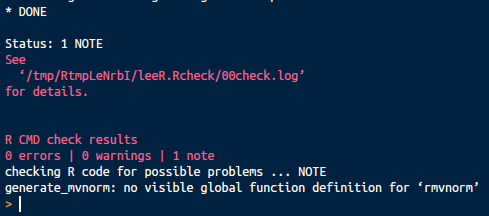
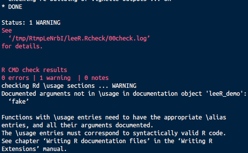
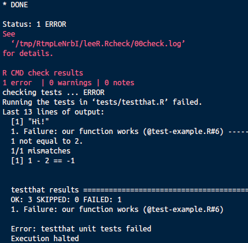

CRAN and R-Packages
========================================================
author: Lee F Richardson
date: Jan 30, 2018
css: custom.css

What is CRAN?
========================================================
&nbsp;

"The "Comprehensive R Archive Network" (CRAN) is a collection of sites which carry identical material, consisting of the R distribution(s), the **contributed extensions**, documentation for R, and binaries."

&nbsp;
- Official CRAN servers throughout the world
&nbsp;
- CRAN servers include **contributed extensions**, (R-packages!)

Why CRAN?
========================================================
&nbsp;

- Authenticity

- Quality Control (adds several more checks)

- More likely to be used

CRAN vs. Github
========================================================
&nbsp;

- CRAN more formal, reliable, but takes more effort

- Github quicker, more lightweight.

- Choice depends on what you're doing (exploring vs. producing)
Data analysis makes more sense Github (Xiao Hui), Formal, generalized
methods make much more sense on CRAN (rigor, quality).

- Don't want to "add to the chaos" if you don't need to

It all comes down to R CMD check
========================================================
&nbsp;

- `R CMD check` is a terminal command
&nbsp;
- Runs series of checks
&nbsp;
- Easy to run with the `devtools` package:


```r
  devtools::check()
```

- Automatically runs documentation,
- Builds package (`R CMD build`) first
- Default uses `--as-cran-`

Three Types: Notes, Warnings, and Errors
========================================================
&nbsp;
&nbsp;

- **Errors**:  Most Severe (e.g. tests don't pass)
&nbsp;
&nbsp;

- **Warnings**: Medium Severe:
&nbsp;
&nbsp;

- **Notes**: Least Severe
&nbsp;
&nbsp;

Note: Interfacing with other functions
========================================================

```r
#' Generate multivariate normal random numbers
#'
#' @param n number of observations
#' @param mean_vec vector of means
#'
#' @return n x length(mean_vec) of observations
#' from a multivariate normal
generate_mvnorm <- function(n = 10, mean_vec = c(1, 1)) {
  sigma <- diag(mean_vec)
  rmvnorm(n = n, mean = c(1, 2), sigma = sigma, method = "chol")
}
```


Note: Interfacing with other functions
========================================================
<div align="center">
  
</div>

Fix with::


```r
  mvtnorm::rmvnorm
```

Warning: Function doesn't match Docs
========================================================

```r
#' Print a string!
#'
#' @param string character containing a string to print
#' @param fake parameter
#' @return A printed string
#' @examples
#' to_print <- "Hello, world!
#' leeR_demo(to_print)
#'
leeR_demo <- function(string) {
  print(string)
}
```

`devtools::check()`...

Warning: Function doesn't match Docs
========================================================

<div align="center">
  
</div>

Error Example: Tests don't pass
========================================================
Say we changed our tests:


```r
test_that("our function works", {
  expect_equal(2, 2)
  expect_equal(1, 2)
})
```

Then ran: `devtools::check()`

***


TRAVIS
========================================================

- Forgetting to run R CMD check consistently builds up problems

- Travis is a "Continuous Integration" service that


Travis CI EXAMPLE
========================================================


```r
  devtools::use_travis("/home/lee/Dropbox/leeR")
```

  language: R
  sudo: false
  cache: packages

WinBuilder
========================================================
- Simple, just sends an e-mail (example)

FINAL STEPS
========================================================
- NOTES
- devools- release


```r
  devtools::release()
```

Conclusions
========================================================
- Better to know in the beginning if you're writing functions that will be used
- Can set-up the infrastucture (e.g. Travis) for ensuring that things work
- Big win for Devtools

Resources
========================================================
http://r-pkgs.had.co.nz/release.html
https://cran.r-project.org/doc/manuals/r-release/R-exts.html#useDynLib
http://www.hep.by/gnu/r-patched/r-faq/R-FAQ_20.html
https://cran.r-project.org/web/packages/policies.html

Two good lists of all the checks are
- http://r-pkgs.had.co.nz/check.html
- Section 1.3.1 of Writing R Extensions
