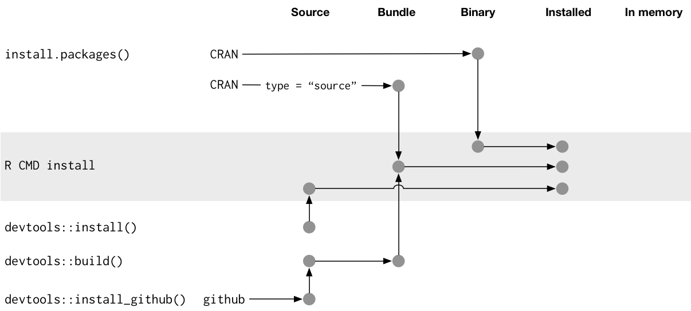
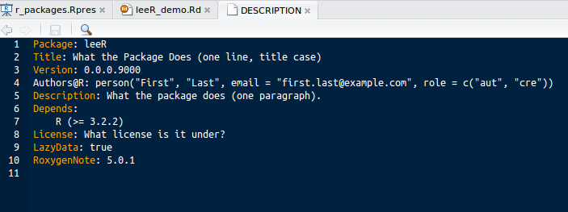
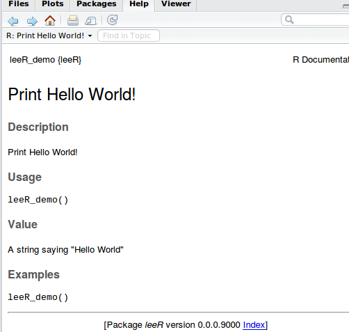

Writing R Packages
========================================================
author: Lee Richardson
date: 1/20/2016
font-family: 'Helvetica'
autosize: true</code>

Goals:

- Build a minimal working package
- Understand how devtools can facilitate this process
- Develop a better understanding of how R Packages work

Why make an R Package?
========================================================
<br><br>
- Packages are the "fundamental units of shareable code"

<br><br>
- Organization, standardized tools

<br><br>
- Fulfillment, building something

A quote from the founder
========================================================
<br><br>

"... from user to programmer to contributor, in the gradual progress that R
encourages. Specifically: using R; simple programming; **packages**
and methods; inter-system interfaces"

John Chambers (Software for Data Analysis: Programming with R)

What is an R Package?
========================================================

- Collection of files, organized in a specific way

- When installed by R, can be used in R Sessions

- Packages are installed into libraries: see yours using `.libPaths()`

- Attached to the session using the `library()` function.


```r
  library(lattice)
  search()
```


The 5 stages of an R package
========================================================


R Packages, Chapter 1

R provides tools (`R CMD INSTALL, R CMD BUILD, R CMD CHECK`, etc...) to move to different stages

Devtools allows us to get our package up an running
========================================================

"The goal of devtools is to make package development as painless as possible"

Hadley Wickham (R Packages)


```r
  install.packages("devtools")
  library("devtools")
```

- Provides a suite of functions which automate the low-level package details, which come with R itself

Devtools serves as a wrapper to many other useful packages
========================================================


R Packages, chapter 1


Step 1: Create the minimal source package
========================================================

An R (*source*) package is just files in a directory, formatted in a specific way.

To create the bare bones R package, just type:


```r
devtools::create("/home/lee/leeR")
```

This should give us:

1. Directory R/
2. NAMESPACE file
3. DESCRIPTION file
4. leeR.rproj file (if using R Studio)

The directory should look like:
========================================================


The description file contains package meta-data
========================================================



Devtools creates the "bare minimum" Description file (similar to `package.skeleton()`)

This is fine for now, but becomes more important when you want to release your package

Step 2: Writing a function
========================================================

All of your R code goes into the `R/` directory. Generally, this code is made up of functions

For example, lets create the file `R/examples.R` and add the function:


```r
leeR_demo <- function(string) {
  print(string)
}
```

Now, we can load the package into memory:


```r
devtools::load_all()
```

More on devtools::load_all()
========================================================

`devtools::load_all()` loads your source package into memory

This is important because in developing a package, you often need to re-install the package over and over


Contrasting with the  `library()` function, which loads (then attaches) already installed packages

Step 2: Documentation our functions
========================================================
<br><br>
- R comes with tools for documentation (`?sum`)
<br><br>
- You can utilize these tools by storing `.Rd` files in a `man/` directory. The `.Rd` look a bit like LaTex
<br><br>
- R renders these files into html, pdf, or whichever format is needed.

Devtools connects with roxygen2 for more convinient documentation
========================================================

The easiest way to document your R code is `roxygen2` package.

Primarily, this allows you to combine code and documentation into a single file, and handles the `.Rd` formatting (and NAMESPACE) for you


```r
install.packages("roxygen2")
library(roxygen2)
```

With roxygen2, we write documentation on top of the function
========================================================


```r
#' Print a string!
#'
#' @param String character containing a string to
#' print
#' @return A printed string
#' @examples
#' leeR_demo()
leeR_demo <- function(string) {
  print(string)
}
```

As a standard workflow, we can use:


```r
devtools::document()
```

========================================================
<br><br>

This creates a `man/` folder, and insert the corresponding `man/leeR_demo.Rd` file that R uses to generate documentation.
<br><br>

Let's see what this looks like:

========================================================

```r
\name{leeR_demo}
\alias{leeR_demo}
\title{Print a string!}
\usage{
leeR_demo(string)
}
\arguments{
\item{string}{character containing a string to
print}
}
\value{
A printed string
}
\description{
Print a string!
}
\examples{
leeR_demo()
}
```


We can now view our documentation in the standard R format
========================================================
<br><br>
`?leeR_demo`
***
<br><br>



Step 4: Testing
========================================================

Testing is critical to making sure your packages do what you expect.

The easiest way to get started with testing is the `testthat` package, which also integrates with `devtools`


```r
install.packages("testthat")
devtools::use_testthat()
```

This will set up the `tests/testthat` directory where we can store tests

How does testthat work?
========================================================

Test-that works hierarchically:

1. Expectation: Fundamental unit of testing. They describe what result is expected of your various computations. We can use these to make sure our functions are giving the expected output.


```r
  expect_equal(1, 1)
```

2. Test: Group of Expectations

3. File: File which contains tests. Must start with `test`

Testing our function
========================================================

Next, let's create a file `tests/testthat/test-example.R`


```r
context("Test our example")

test_that("our function works", {
  expect_equal(leeR_demo("Hi!"), "Hi!")
  expect_equal(2, 2)
  expect_equal(1, 2)
})
```

Now run:


```r
devtools::test()
```

Example output from testthat:
========================================================

<div align="center">

</div>

Step 5: Syncronizing with Github
========================================================

This allows users to install your package without being hosted on CRAN.

For example, you could install the R package I just made using:


```r
devtools::install_github(repo = "leerichardson/leeR")
library(leeR)
?leeR_demo
leeR_demo("Hi!")
```

Remarkably, the package is available to everyone with an internet connection

Instructions for syncronizing with Github
========================================================

1. Create a Github repository with the same name as your package
2. Use the following commands from the command line:


```r
echo "# leeR" >> README.md
git init
git add --all
git commit -m "First Commit!"
git remote add origin https://github.com/username/packagename.git
git push -u origin master
```

Now check out the Github page, all of the code is there!

Congratulations! You now have your own personal R Package
========================================================

There are many more great features of to look into, including:
- Including data
- Vignettes (long form documentation, knitr)
- Compiled code (C, C++, Fortran...)

Good Resources:
- R Packages. Hadley Wickham
- Software for Data Analysis: Programming with R. John Chambers
- Writing R Extensions (the official documentation)

Thanks!
========================================================
<br><br>
<br><br>

Questions?
